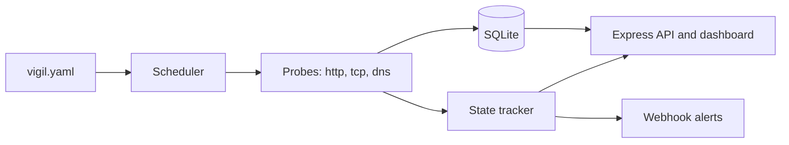

# vigil

A self-hosted synthetic uptime monitor with a built-in status page. Define HTTP, TCP, and DNS checks in one YAML file, run a single process, and get a dark-themed dashboard, historical uptime numbers, latency sparklines, and webhook alerts on every up or down transition.

## Why

Hosted uptime services are great until you need to watch things that are not on the public internet: an internal admin panel, a database port, a DNS record that must keep pointing at the right place. vigil is the small, boring alternative. One Node.js process, one SQLite file, one YAML config, no accounts, and nothing leaves your network unless you configure a webhook.

Design goals:

- Zero infrastructure. SQLite via better-sqlite3, no external services.
- Honest alerting. A check must fail N times in a row before it counts as down, so a single blip does not page anyone.
- A status page you can put on a wall. Self-contained HTML, no build step, no CDN dependencies.

## Quickstart

Requires Node.js 20 or newer.

```bash
git clone https://github.com/aryan-jaigirdar/vigil.git
cd vigil
npm install
npm run build

# validate the example config, then start
node dist/cli.js validate --config vigil.yaml
node dist/cli.js run --config vigil.yaml
```

Open http://localhost:3080 for the dashboard. The JSON API lives at `/api/status` and `/api/history/<check>`, and `/healthz` answers liveness probes so you can monitor the monitor.

During development, `npm run dev` runs the CLI straight from the TypeScript sources.

### Docker

The repository ships a multi-stage Dockerfile that compiles the TypeScript and runs the compiled CLI against the bundled example config.

```bash
docker build -t vigil .
docker run -p 3080:3080 vigil
```

The container starts `vigil run --config vigil.yaml`. Mount your own config at `/app/vigil.yaml` to override the example, and mount a volume at `/app` if you want the SQLite history to survive a restart.

## Configuration

Checks live in a YAML file, `vigil.yaml` by default. The repository root contains a commented example. Unknown keys are rejected, so typos fail fast at startup instead of silently doing nothing.

### Top level

| Key | Type | Default | Description |
|---|---|---|---|
| `port` | integer | `3080` | Port for the dashboard and JSON API. |
| `database` | string | `vigil.db` | Path to the SQLite database file. |
| `retention_days` | integer | `7` | How long raw results are kept. Older rows are pruned hourly. |
| `failure_threshold` | integer | `2` | Consecutive failures required before a check is considered down. |
| `webhooks` | list of URLs | `[]` | Webhooks that receive a JSON POST on every state transition. |
| `checks` | list | required | The checks to run. At least one. |

### Common check fields

| Key | Type | Default | Description |
|---|---|---|---|
| `name` | string | required | Unique identifier, shown on the dashboard and in alerts. |
| `type` | string | required | One of `http`, `tcp`, `dns`. |
| `interval` | integer (seconds) | `60` | How often the check runs. |
| `timeout` | integer (milliseconds) | `5000` | Per-probe timeout. |

### `http` checks

| Key | Type | Default | Description |
|---|---|---|---|
| `url` | string | required | The URL to request. `http` or `https`. |
| `method` | string | `GET` | One of GET, HEAD, POST, PUT, PATCH, DELETE, OPTIONS. |
| `expect_status` | integer | none | Exact status code required. Without it, any 2xx or 3xx passes. Redirects are followed by default, but when `expect_status` is set the first response is judged as-is, so you can assert on a 301 or 302. |
| `keyword` | string | none | Substring the response body must contain. |
| `headers` | map of string to string | none | Extra request headers sent with the probe, for example an API token or an environment selector. Each value must be a string. |

Example of an http check with custom headers:

```yaml
checks:
  - name: authed-endpoint
    type: http
    url: https://example.com/api
    headers:
      Authorization: Bearer token123
      X-Env: staging
```

### `tcp` checks

| Key | Type | Default | Description |
|---|---|---|---|
| `host` | string | required | Hostname or IP address to connect to. |
| `port` | integer | required | TCP port. The probe passes if the connection is established. |

### `dns` checks

| Key | Type | Default | Description |
|---|---|---|---|
| `hostname` | string | required | Name to resolve. A records are queried first, with an AAAA fallback when the name has no A records. |
| `expected_ip` | string | none | When set, this address must appear in the answers. |

## State model and alerting

Every check starts as `unknown`. One successful probe moves it to `up`. A probe failure only moves it to `down` after `failure_threshold` consecutive failures, which suppresses flapping. While failures are accumulating below the threshold, the previous state is retained.

Webhooks fire on `up -> down`, `down -> up`, and `unknown -> down` (a target that is already broken when vigil starts is worth an alert). The initial `unknown -> up` settle is silent, so restarting vigil against a healthy fleet does not send a wave of recovery notifications.

### Alert webhooks

Each transition produces one HTTP POST per configured webhook with `Content-Type: application/json`:

```json
{
  "event": "check.down",
  "check": "example-homepage",
  "checkType": "http",
  "state": "down",
  "previousState": "up",
  "consecutiveFailures": 2,
  "latencyMs": 5000,
  "error": "timed out after 5000ms",
  "timestamp": "2026-01-15T12:34:56.789Z"
}
```

Recovery events use `"event": "check.up"`, `"state": "up"`, and `"consecutiveFailures": 0`. Delivery is best-effort: a webhook that is down or slow (5 second timeout) is logged and skipped, and never affects scheduling or other webhooks.

## Dashboard and API

`GET /` serves a single self-contained HTML page: a status pill per check, uptime over the last 24 hours and 7 days, a latency sparkline built from recent results (failed probes are marked on the line), the last measured latency, and the most recent error when a check is failing. The page polls the API every 10 seconds.

| Endpoint | Description |
|---|---|
| `GET /api/status` | Current state, uptime percentages, and last result for every check. |
| `GET /api/history/:check?limit=120` | Recent results for one check, oldest first, capped at 500. |
| `GET /healthz` | Liveness endpoint, always `{"ok": true}`. |

## Architecture

One process, five moving parts. The scheduler staggers first runs across a short window so a restart does not fire every probe at once, and it skips a tick when the previous probe of the same check is still in flight.



Results are appended to a single SQLite table indexed by check name and timestamp. Uptime is computed on demand with an aggregate query, and rows older than the retention window are pruned hourly. State (up, down, consecutive failure counts) is kept in memory and rebuilt from live probes after a restart.

The process shuts down cleanly on SIGINT or SIGTERM: timers are cancelled, the HTTP server closes its connections, and the database is closed. A second signal, or a shutdown that takes more than ten seconds, forces an exit.

## Development

```bash
npm run build   # compile TypeScript to dist/
npm test        # run the vitest suite
npm run dev     # run from sources against vigil.yaml
npm start       # run the compiled CLI against vigil.yaml
```

The test suite covers config parsing and validation, the state machine and flap suppression, uptime math and retention pruning, the HTTP and TCP probes against a local test server, webhook delivery, scheduler behavior, and the JSON API.

## License

MIT, see [LICENSE](LICENSE).
